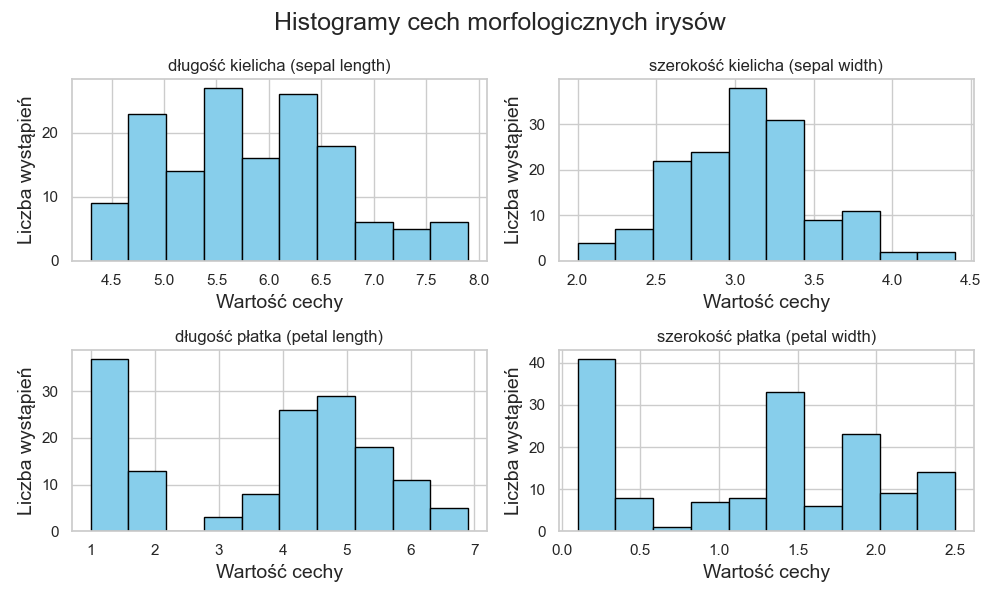
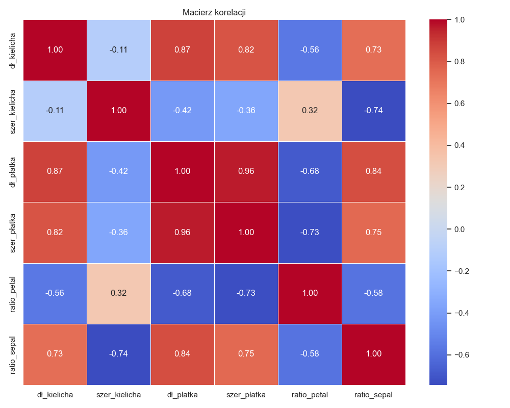
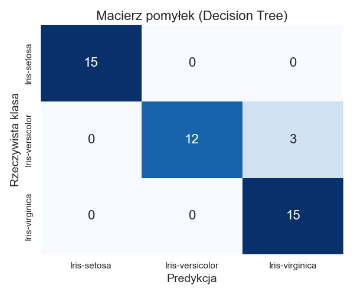

# 🪻 Irysy 🌼 - Eksploracyjna Analiza Danych (EDA)

Ten projekt zawiera kompletną eksploracyjną analizę danych (EDA) na klasycznym zbiorze danych Irysy .

## Zawartość
Repozytorium zawiera:
- Notebook `Irysy.ipynb` z kompletną eksploracyjną analizą danych (EDA), wizualizacjami i modelami ML
- Plik `iris.csv` z danymi źródłowymi
- Folder `results/` z przykładowymi wykresami wygenerowanymi podczas analizy (histogramy, heatmapa, macierz pomyłek i inne)
- Folder `Foto/` z okładką projektu oraz zdjęciami trzech gatunków irysów
- Plik `requirements.txt` z wersjami wymaganych bibliotek (pandas, numpy, matplotlib, seaborn, scikit-learn)
- Plik `.gitignore` ignorujący pliki tymczasowe i środowiskowe
- Plik `LICENSE` (MIT License)
- Rozbudowane `README.md` z instrukcją uruchomienia, badge, sekcją demo (Colab), kontaktami, przykładowymi wynikami i checklistą EDA

Każdy z tych elementów wspiera czytelność, powtarzalność i prezentację projektu w portfolio.

## Jak uruchomić
1. Zainstaluj wymagane biblioteki:
   ```bash
   pip install -r requirements.txt
   ```
2. Otwórz notebook `Irysy.ipynb` w Jupyter Notebook lub VS Code.
3. Przejdź przez kolejne komórki, aby zobaczyć analizę i wizualizacje.

## Jak uruchomić demo

Chcesz szybko uruchomić analizę bez instalacji? Skorzystaj z Google Colab:

[](https://colab.research.google.com/github/AlanSteinbarth/Irysy/blob/main/Irysy.ipynb)

Możesz też pobrać repozytorium i uruchomić notebook lokalnie zgodnie z instrukcją powyżej.

## Wymagane biblioteki
- pandas
- numpy
- matplotlib
- seaborn
- scikit-learn

## Kontakt

[](https://github.com/AlanSteinbarth)
[](https://www.linkedin.com/in/alansteinbarth)
[](mailto:alan.steinbarth@gmail.com)

Chętnie odpowiem na pytania dotyczące projektu lub współpracy!

---

## Badge


[](https://colab.research.google.com/github/AlanSteinbarth/Irysy/blob/main/Irysy.ipynb)

---

## Podsumowanie projektu

Projekt prezentuje pełny cykl eksploracyjnej analizy danych (EDA) na klasycznym zbiorze Irysów. Zawiera:
- Wczytanie i przygotowanie danych
- Analizę braków i duplikatów
- Wizualizacje i statystyki opisowe
- Analizę relacji między cechami
- Identyfikację wartości odstających
- Porównanie modeli ML (drzewo decyzyjne, kNN, regresja logistyczna)
- Wizualizacje PCA i t-SNE

Projekt pokazuje praktyczne umiejętności analityczne, znajomość narzędzi Python (pandas, seaborn, scikit-learn) oraz dbałość o czytelność i dokumentację.

## Przykładowe zdjęcia badanych gatunków Irysów 

Poniżej przedstawiono przykładowe zdjęcia trzech gatunków Irysów analizowanych w projekcie:

| Iris-setosa | Iris-virginica | Iris-versicolor |
|:-----------:|:--------------:|:---------------:|
|  |  |  |

Każdy z tych gatunków posiada charakterystyczne cechy morfologiczne, które są analizowane w notebooku.

**Źródło zdjęć:** Wszystkie zdjęcia irysów pochodzą z Wikipedii (https://pl.wikipedia.org/wiki/Irys_(ro%C5%9Blina)). Wykorzystane zgodnie z licencją Wikimedia Commons. Jeśli wykorzystujesz ten projekt, pamiętaj o zachowaniu informacji o autorach i licencji zdjęć.

## Przykładowe wyniki i wykresy

W folderze `results/` znajdziesz przykładowe wykresy wygenerowane podczas analizy:

- Histogramy cech morfologicznych irysów
- Pairplot cech z podziałem na gatunek
- Heatmapa korelacji
- Macierz pomyłek (Decision Tree)
- Wizualizacja PCA i t-SNE

Przykład:

| Histogram cech | Heatmapa korelacji | Macierz pomyłek |
|:--------------:|:------------------:|:---------------:|
|  |  |  |

Wszystkie wykresy możesz wygenerować samodzielnie uruchamiając notebook lub skorzystać z gotowych plików w `results/`.
